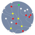
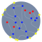
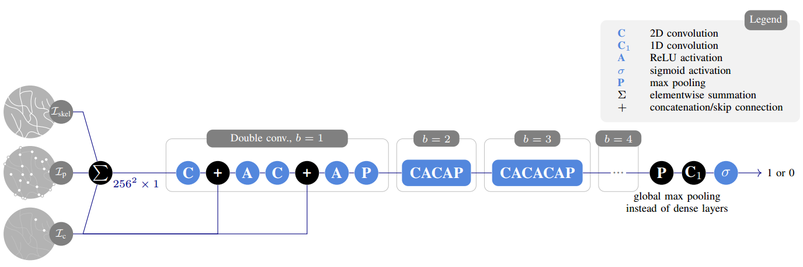

# tfgraph
Extraction of graphs from skeletonised images.  
A TensorFlow implementation.


The graph extraction consists of a 
**[node extraction](#node-extraction)** part,
an **[edge extraction](#edge-extraction)** part and a
**[combination scheme](#combination-scheme)**
for the edge predictions.

## Node Extraction
The nodes as well as their attributes are extracted
using a model based on the U-Net.

| Positions | Degrees      | Types                 |
| :-------: | :----------: | :-------------------: |
|  |  |  |
|           | 0, 1, 2, 3, 4| end, crossing, border |

Current best model: 4f
([wandb](https://wandb.ai/salehah/node_extraction/runs/91pmt9xd))
([yaml](./configs/91pmt9xd.yaml))
([h5](./wandb/91pmt9xd.h5))

### Training
1. Define configuration:
    * [Dataset config](./config.yaml) -- change
        `data_path` and `validation_fraction` as needed.
    * Model config in [configs](./configs/),
        e.g.[sample_nodes_nn.yaml](./configs/sample_nodes_nn.yaml).
2. Set config filepath in [nodes_nn.py (L7)](./nodes_nn.py#L7)
3. Run [nodes_nn.py](./nodes_nn.py).   
    ```
    nohup python nodes_nn.py > nodes_nn_log.txt &
    ```

### Testing
1. Initialise variables:  
    - Set network type to `NetworkType.NODES_NN` in [evaluate.py (L5)](./evaluate.py#L5).
    - Populate `model_ids` list with the IDs of the model(s) to be tested in [evaluate.py (L6)](./evaluate.py#L6).
    - Ensure that `eval_nodes_nn.yaml` is set in the second argument of `run.get_configs` in [evaluate.py (L11)](./evaluate.py#L11).
3. Model configuration and weights — ensure that these files exist:  
    * Model config yaml file in [configs](./configs/),
        e.g.[sample_nodes_nn.yaml](./configs/sample_nodes_nn.yaml).
    * Model weights in the path used in [evaluate.py (L21)](./evaluate.py#L21).  
        Default path: `wandb/{model_id}.h5`.
4. Choose the type of evaluation to be done,
    modify/comment out what's not needed:   
    * Visualise batch predictions [(L33 - L35)](./evaluate.py#L33..L35)
    * Evaluate metrics per test image [(L37 - L44)](./evaluate.py#L37..L44)
5. Run [evaluate.py](./evaluate.py).

## Edge Extraction
Prediction of the existence of an edge
between a pair of nodes using a VGG-based model.



Current best model: baseline
([wandb](https://wandb.ai/salehah/node_extraction/runs/1m3yxeop))
([yaml](./configs/1m3yxeop.yaml))
([h5](./wandb/1m3yxeop.h5))

## Combination Scheme
Parallel batched edge predictions.
